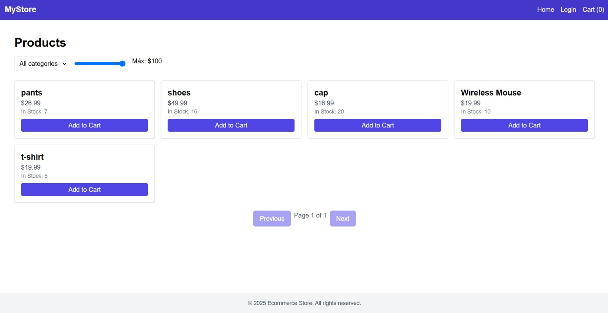
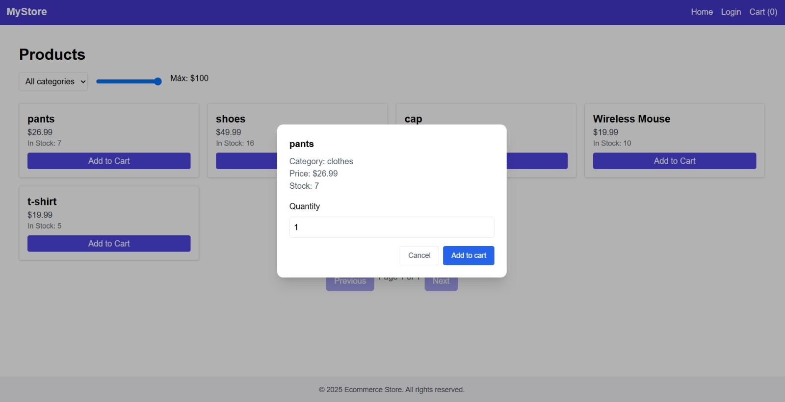
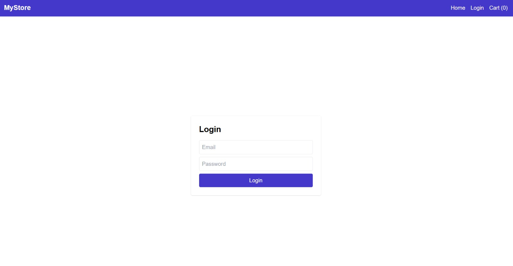
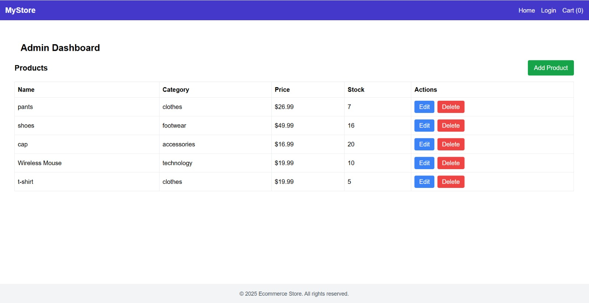

# 🛒 React Shop - E-commerce Básico

Este proyecto es una aplicación web de tienda online construida con **React.js**, que permite explorar productos, filtrarlos por categoría y precio, agregar al carrito y autenticarse mediante un sistema básico de login.

## 🚀 Demo en Producción

🔗 [Ver la tienda en vivo](https://tutienda.vercel.app)

## 🧩 Características

- ✅ Listado de productos con paginación
- ✅ Filtro por categoría y precio
- ✅ Modal de detalles de producto
- ✅ Carrito de compras
- ✅ Autenticación con login
- ✅ CRUD de productos (solo para admin)
- ✅ Manejo global de estado con Zustand
- ✅ Feedback de usuario con Toasts (react-hot-toast)
- ✅ Diseño responsive con TailwindCSS

## 🖼️ Capturas de Pantalla

### Vista principal (Home)



### Modal de producto



### Login



### CRUD de productos



> Puedes guardar las imágenes en `/public/screenshots/` y cambiar los nombres si usas otros.

---

## ⚙️ Tecnologías Utilizadas

- React.js
- Zustand
- React Router DOM
- TailwindCSS
- React Hot Toast
- Headless UI (modals)
- Vite (como bundler)
- Vercel (para despliegue)

---

## 📂 Estructura del Proyecto

src/
├── components/ # Componentes reutilizables (modal, pagination...)
├── pages/ # Vistas principales (Home, Login, AdminDashboard, NotFound)
├── stores/ # Zustand: auth, cart, products
├── services/ # Funciones para llamadas externas
├── App.jsx # Enrutamiento principal
└── main.jsx # Punto de entrada

---

## 📦 Cómo Ejecutar Localmente

1. Clonar el repositorio:

```bash
git clone https://github.com/matiasjaque-dev/eccomerce-store-react.git
cd eccomerce-store-react
Instalar dependencias:

npm install

Iniciar en modo desarrollo:

npm run dev

📬 Contacto
Desarrollado por Matías Jaque Montecinos
📧 Email: matias.jaque.dev@gmail.com
💼 LinkedIn: linkedin.com/in/tuusuario
```
